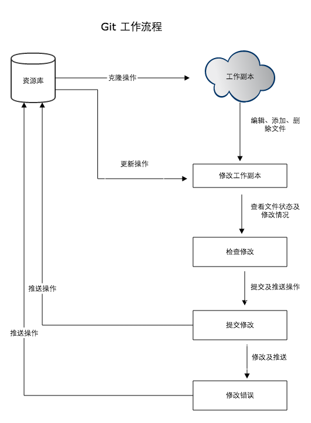

# Git 基本版本控制

- 功能列表
|  命令 | 说明  |
|---|---|
| `git status ./`  | 显示工作路径下所有已修改的文件  |
| `git diff ./`  | 显示与上次提交版本文件的不同  |
| git branch  | 查看本地分支  |
| git checkout (branch)	  | 切换当前分支  |
| git checkout -b hqp_testbench  | 创建并切换当前分支  |
| git add test_bench  | 将指定文件夹下所有修改添加到下一次提交中  |
| git commit  | 提交本地修改  |
| git commit --no-verify  | 绕过代码风格检查  |
| git stash  | 备份当前工作区的内容，保存到Git栈  |
| git stash pop  | 从Git栈中读取最近一次的内容，恢复工作区的相关内容  |
| git stash list  | 显示Git栈内的所有备份  |
| git stash show -p stash{3}  | 查看某个stash具体内容  |
| git stash clear  | 清空git栈  |
| git rebase -i HEAD~3  | 合并3个commit；git push -f更新远端  |
| git submodule update --init --recursive  | 拉取并更新子仓库  |
| git push origin hqp_testbench	  |   |

- tig status	查看代码合并细节
s	查看本地修改(同上)
e	进入代码文件
u	添加到本地仓库（git add）
q	退出到上一层

- 注：
使用git reflog show命令,可以查看完整的提交历史；
使用git reset --hard commit_id，进行版本回退；
使用git revert commit_id命令，撤销某次提交的修改。

- 代码仓库同步到码云
|[ GitHub 项目导入码云](https://blog.gitee.com/2018/06/05/github_to_gitee/)|--|[廖雪峰-使用Gitee](https://www.liaoxuefeng.com/wiki/896043488029600/1163625339727712)|

**参考**
- [看完这篇还不会用Git，那我就哭了！](https://zhuanlan.zhihu.com/p/94008510)
- [知乎-Git](https://www.zhihu.com/search?type=content&q=Git)
- [猴子都能懂的Git入门](https://backlog.com/git-tutorial/cn/)