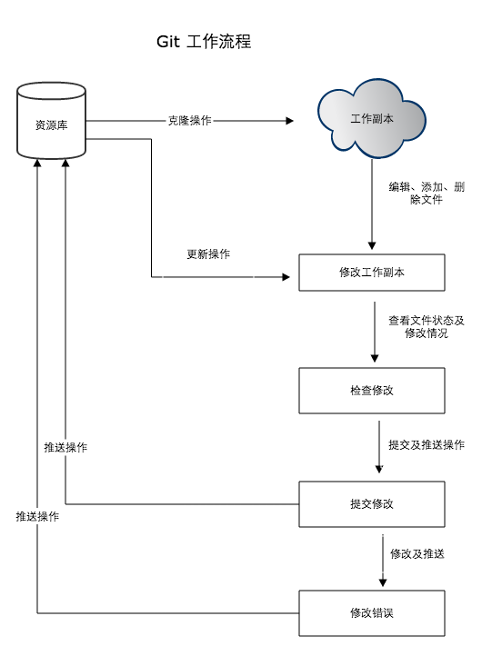
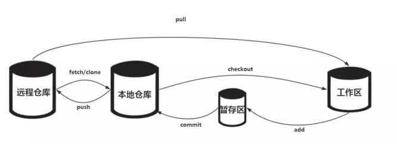

# Git 基本版本控制

- 功能列表

|  命令 | 说明  |
|---|---|
| `git status ./`  | 显示工作路径下所有已修改的文件  |
| `git diff ./`  | 显示与上次提交版本文件的不同  |
| git branch  | 查看本地分支  |
| git checkout (branch)	  | 切换当前分支  |
| git checkout -b hqp_testbench  | 创建并切换当前分支  |
| git add test_bench  | 将指定文件夹下所有修改添加到下一次提交中  |
| git commit  | 提交本地修改  |
| git commit --no-verify  | 绕过代码风格检查  |
| git stash  | 备份当前工作区的内容，保存到Git栈  |
| git stash pop  | 从Git栈中读取最近一次的内容，恢复工作区的相关内容  |
| git stash list  | 显示Git栈内的所有备份  |
| git stash show -p stash{3}  | 查看某个stash具体内容  |
| git stash clear  | 清空git栈  |
| git rebase -i HEAD~3  | 合并3个commit；git push -f更新远端  |
| git submodule update --init --recursive  | 拉取并更新子仓库  |
| git remote -v | 查看远程库信息  |
| git push [远程库名] [分支名]	  |  推送到远程库的指定分支 |

- git diff  查看代码修改差异

|  命令 | 说明  |
|---|---|
| `git diff branch1 branch2`  | 显示出所有有差异的文件的详细差异  |
| `git diff branch1 branch2 具体文件路径`  | 显示指定文件的详细差异  |
| `git diff branch1 branch2 --stat`  | 显示出所有有差异的文件列表 |
| `git diff branch1 branch2 --stat [path]`  | 查询两个分支某个路径下的差异文件列表 |

- tig status	查看代码合并细节

s	查看本地修改(同上)；
e	进入代码文件；
u	添加到本地仓库（git add）；
q	退出到上一层

- 注：

使用git reflog show命令,可以查看完整的提交历史；
使用git reset --hard commit_id，进行版本回退；
使用git revert commit_id命令，撤销某次提交的修改。

